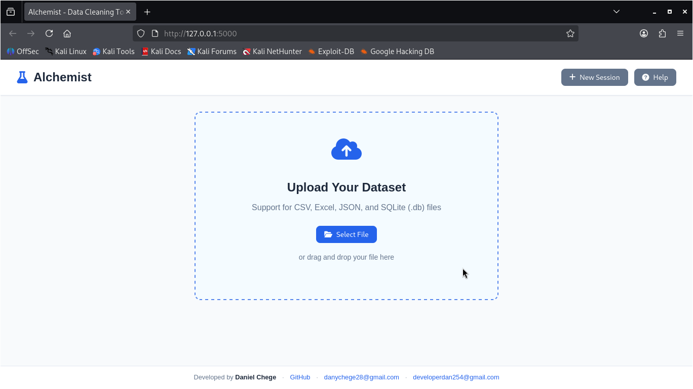
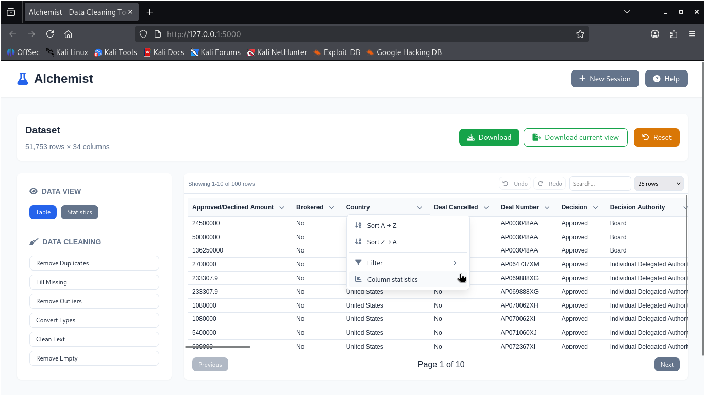
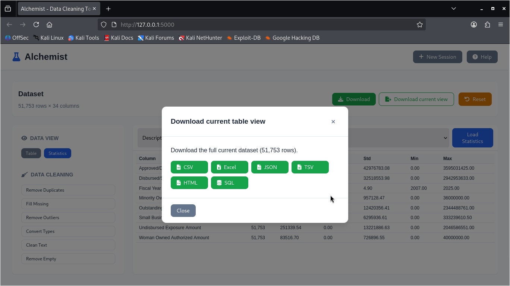

# Alchemist - Data Cleaning and Transformation Tool

Alchemist is a web-based data cleaning and transformation tool built with a Python Flask backend and a modern JavaScript frontend. Upload, clean, transform, visualize, and export datasets from CSV, Excel, JSON, and SQLite with session management and **case-insensitive** filtering and search.

---

## Live Demo

https://alchemist-6qfo.onrender.com/

You can use the hosted online version at the link above, or run it locally using `./alchemist.sh` (see Installation & Setup).

To experience the full power of Alchemist, it’s advisable to run it locally. The online demo is hosted on Render’s free tier, so not all capabilities may be available.

## Technology

- **Backend**: Python (Flask)
- **Frontend**: HTML, CSS, JavaScript (served by Flask)
- **Visualization**: Plotly.js (frontend) + Matplotlib/Seaborn/Plotly (backend)
- **Deployment**: Render (live demo)

## Python Libraries Used

Backend dependencies (see `backend/requirements.txt`):

- **Flask**
- **Flask-CORS**
- **pandas**
- **numpy**
- **scipy**
- **matplotlib**
- **seaborn**
- **plotly**
- **openpyxl** (Excel `.xlsx` support)
- **xlrd** (Excel `.xls` support)
- **python-dateutil**
- **pytz**
- **gunicorn** (production server)

## Features

### Data Upload & Management
- **Multiple format support**: CSV, Excel (.xlsx, .xls), JSON, **SQLite** (.db, .sqlite, .sqlite3), and **SQL dumps** (.sql)
- **Drag & drop**: File upload with progress
- **Data preview**: Instant preview and metadata after upload
- **Session management**: Persistent sessions; **New Session** clears state and returns to upload screen

### Data Cleaning Operations
- **Remove duplicates**: Eliminate duplicate rows
- **Handle missing values**: Fill with mean, median, mode, or custom value
- **Outlier detection**: IQR, Z-score, or Modified Z-score
- **Data type conversion**: Convert column types
- **Text cleaning**: Trim whitespace, normalize case
- **Remove empty rows/columns**
- **Facet into**: Group and analyze data by categorical values

### Table & Column Tools
- **Column header dropdown** (per column):
  - **Sort A→Z / Z→A**: Sort ascending or descending
  - **Filter**: Inline filter with operator (Equals, Not Equals, Greater Than, Less Than, Contains, Not Contains) and value
  - **Facet into**: Group data by unique values in the column with counts and percentages
  - **Column statistics**: Jump to Statistics view for that column
- **Case-insensitive behavior**: All filters and table search are **case-insensitive** (e.g. "yes" matches "YES")
- **Table search**: Real-time search across all columns (case-insensitive)
- **Pagination**: Configurable rows per page

### Facet Operations
- **Create facets**: Select any column and choose "Facet into" to see distribution of values
- **Value counts**: Display exact counts and percentages for each unique value
- **Interactive filtering**: Click facet values to instantly filter the table
- **Multi-column analysis**: Create multiple facets to understand data relationships
- **Export faceted data**: Download filtered results after applying facet selections

### Large File Mode (for bigger CSV files)

For large CSV uploads, Alchemist automatically switches to **Large File Mode** to keep memory usage stable.

- **How it works**: the uploaded CSV is imported into a local **SQLite** database and the table view uses server-side paging.
- **Threshold**: by default this activates for CSV files >= **25MB** (`LARGE_FILE_THRESHOLD_BYTES`).

Supported in Large File Mode:

- **Pagination** (server-side)
- **Filter** (server-side)
- **Sort** (server-side)
- **Search** (server-side, case-insensitive)
- **Cleaning (subset)**:
  - Remove duplicates
  - Remove empty rows
  - Clean text (trim whitespace, normalize case)

Not yet supported in Large File Mode:

- Full in-memory operations pipeline (some cleaning/preview features)
- Statistics and plots for the entire dataset

### Preview Operations
- **Preview before applying**: Run remove duplicates, remove empty rows, clean text (trim, normalize case) on a sample and compare **Original** vs **Preview**
- **Preview on current view**: If a filter is applied, preview runs on the **filtered data** so you see the effect on the subset you care about
- **Download preview data**: In the Preview Results modal you can download:
  - **Original** (before operations): CSV, Excel, JSON, TSV, HTML
  - **Preview** (after operations): CSV, Excel, JSON, TSV, HTML

### Export & Download
- **Download** (main button): Export full dataset from server (CSV, Excel, JSON, TSV, HTML, SQL)
- **Download current view**: Export the **current table** (filtered or full) as CSV, Excel, JSON, TSV, HTML, or SQL
- **Preview Results modal**: Download original or preview sample in CSV, Excel, JSON, TSV, HTML, or SQL

### Visualization & Analysis
- **Charts**: Histograms, scatter, bar, box, heatmap, line, pie (Plotly.js)
- **Statistics**: Descriptive, categorical, correlation, data quality, outlier detection
- **Undo / Redo**: Revert or reapply the last operation

### Other
- **Reset**: Restore dataset to last uploaded state
- **Case-insensitive operations**: Filter and search ignore letter case

### Clustering (fuzzy merge)

Alchemist includes a clustering tool for categorical columns.

- **Suggest similar values**: Find values that are likely the same (based on fingerprinting)
- **Merge to canonical**: Replace multiple variants with a single chosen canonical value

---

## Screenshots

### Home Screen - Upload & Data Management


### Table View - Data Cleaning & Filtering


### Statistics & Analysis


### Export & Download Options


---

## Project Structure

```
Alchemist/
├── backend/
│   ├── app.py              # Flask app and API
│   ├── requirements.txt
│   ├── modules/
│   │   ├── data_handler.py # Load, clean, filter, preview
│   │   ├── visualization.py
│   │   └── stats.py
│   └── utils/
│       └── helpers.py
├── frontend/
│   ├── index.html
│   ├── styles.css
│   └── app.js
├── data/                   # Uploads and session data
└── README.md
```

---

## Installation & Setup

### Option 1: Use the online demo

Open:

https://alchemist-6qfo.onrender.com/

### Option 2: Run using `alchemist.sh` (recommended)

From the project root:

```bash
chmod +x ./alchemist.sh
./alchemist.sh run
```

Then open **http://127.0.0.1:5000**.

By default, Alchemist will also try to open your browser automatically. To disable this behavior:

```bash
ALCH_OPEN_BROWSER=0 ./alchemist.sh run
```

To build an offline executable (PyInstaller):

```bash
./alchemist.sh build
```

The executable will be in `dist/Alchemist/`.

### Option 2b: Run using `alchemist.bat` (Windows)

From the project root in Command Prompt or PowerShell:

```cmd
alchemist.bat run
```

Then open **http://127.0.0.1:5000**.

By default, Alchemist will also try to open your browser automatically. To disable this behavior:

```cmd
set ALCH_OPEN_BROWSER=0
alchemist.bat run
```

To build an offline executable (PyInstaller):

```cmd
alchemist.bat build
```

The executable will be in `dist\Alchemist.exe`.

### Run the Linux executable (release build)

If you downloaded a prebuilt Linux release archive (for example `Alchemist-linux-x86_64.tar.gz`), extract it and run the bundled executable:

```bash
tar -xzf Alchemist-linux-x86_64.tar.gz
cd Alchemist
./Alchemist
```

It will start the local server and open your browser to the correct `localhost` URL.

Useful environment variables:

```bash
# Change port
PORT=5001 ./Alchemist

# Disable browser auto-open
ALCH_OPEN_BROWSER=0 ./Alchemist
```

### Install (Linux)

1. Download the latest release

```bash
curl -L https://github.com/danchege/Alchemist/releases/latest/download/Alchemist-linux-x86_64.tar.gz -o Alchemist-linux-x86_64.tar.gz
```

2. Extract the archive

```bash
tar -xzf Alchemist-linux-x86_64.tar.gz
```

3. Install globally

```bash
cd Alchemist-linux-x86_64
sudo ./install.sh
```

Manual install (alternative):

```bash
sudo mkdir -p /opt/alchemist
sudo rm -rf /opt/alchemist/Alchemist-linux-x86_64
sudo mv Alchemist-linux-x86_64 /opt/alchemist/
sudo ln -sf /opt/alchemist/Alchemist-linux-x86_64/Alchemist /usr/local/bin/Alchemist
```

4️⃣ Run

```bash
Alchemist
```

Uninstall:

```bash
cd /opt/alchemist/Alchemist-linux-x86_64
sudo ./uninstall.sh
```

### Option 3: Manual setup (create venv in `backend/`)

1. Go to the backend directory (all manual commands below run from here):
   ```bash
   cd Alchemist/backend
   ```

2. Create and activate a virtual environment in the `backend/` folder:
   ```bash
   python -m venv .venv
   # Linux/macOS:
   source .venv/bin/activate
   # Windows (PowerShell):
   .venv\Scripts\Activate.ps1
   ```

3. Install dependencies and run:
   ```bash
   pip install -r requirements.txt
   python app.py
   ```

   Server runs at **http://localhost:5000**.

### Frontend

The Flask app serves the frontend. Open **http://localhost:5000** in your browser.

---

## Usage

### 1. Upload data
- Click **Select File** or drag and drop a CSV, Excel, JSON, SQLite (.db/.sqlite), or SQL dump (.sql) file.
- After processing, the workspace opens with the table view.

### 2. Work with the table
- **Sort**: Click a column name for A→Z, or open the column **▼** menu and choose Sort A→Z or Sort Z→A.
- **Filter**: Open the column **▼** menu → **Filter** → choose operator and value → **Apply**. Or use the sidebar filter and **Apply Filter**.
- **Search**: Type in the search box; matching is case-insensitive across all columns.
- **Download current view**: Click **Download current view**, pick format (CSV, Excel, JSON, TSV, HTML). This exports the currently visible data (filtered or full).

### 3. Preview operations
- Click **Preview** in the sidebar.
- Select operations (e.g. Remove Duplicates, Remove Empty Rows, Clean Text) and sample size.
- If you have a filter applied, the preview uses the **filtered** data.
- Click **Preview** in the modal to see Original vs Preview; use **Download** in that modal to export either side in multiple formats.

### 4. Apply cleaning and export
- Use **Remove Duplicates**, **Fill Missing**, **Clean Text**, etc. from the sidebar.
- Use **Download** for the full dataset, or **Download current view** for the current table.
- **New Session**: Clears state and shows the upload screen again (any unsaved work is lost after you confirm).

### 5. Use facet operations
- **Facet into**: Open the column **▼** menu → **Facet into** to group data by unique values in that column
- **Explore facets**: View counts and percentages for each unique value in the selected column
- **Filter by facet**: Click on any facet value to filter the table to show only rows with that value
- **Combine facets**: Create multiple facets on different columns to analyze data intersections
- **Remove facets**: Clear individual facets or all facets to return to the full dataset view

---

## API Overview

- `POST /api/upload` – Upload file, create session
- `GET /api/data/info` – Dataset info
- `POST /api/download` – Export full data (CSV/Excel/JSON)
- `POST /api/clean` – Cleaning operations
- `POST /api/filter` – Apply filters (case-insensitive)
- `POST /api/preview` – Preview operations (optional `data` = current filtered rows)
- `POST /api/undo`, `POST /api/redo`, `POST /api/reset`
- `GET /api/stats`, `POST /api/visualize`, etc.

---

## Behaviour Notes

- **Case-insensitive**: Filter (equals, not equals, contains, not contains) and table search ignore case.
- **New Session**: Resets app state, clears table and filters, shows upload; next upload gets a new session.
- **Preview on filter**: When you run Preview with an active filter, the sample is taken from the filtered data.

---

## Troubleshooting

- **Upload fails**: Use CSV, Excel, JSON, or SQLite (.db); check file size and that the file isn’t corrupted.
- **Charts not showing**: Check console for errors; ensure Plotly loads and data has suitable columns.
- **Slow with large data**: Use filters or reduce rows per page.

---

## License

MIT License.

---

**Alchemist** – Clean, transform, and export your data with case-insensitive filters and flexible preview and download options.
